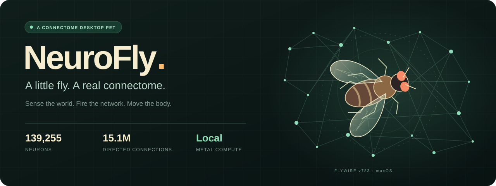
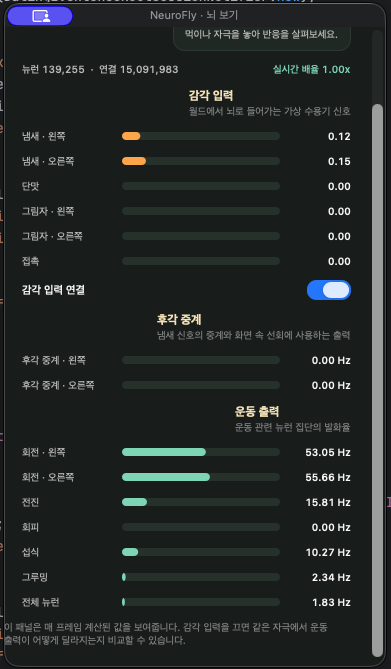

<div align="center">



### 화면 위를 날아다니는, 작은 신경망 실험실

실제 초파리의 **신경 연결 데이터**로 활동을 계산하고,<br />
먹이와 자극에 대한 반응을 바탕화면 속 작은 몸체에 연결합니다.


[빠른 시작](#빠른-시작) · [사용하기](#사용하기) · [뇌에서 움직임까지](#뇌에서-움직임까지) · [검증](#검증) · [출처](#출처와-이용-조건)

</div>

---

## 작은 펫, 관찰할 수 있는 반응

큰 창을 계속 열어둘 필요 없이, 바탕화면 위에 초파리 한 마리가 떠 있습니다.
메뉴 막대의 **🪰**에서 먹이를 놓거나 그림자를 만들고, **상태 보기**를 열어
그 순간의 감각 입력과 뉴런 활동을 함께 살펴볼 수 있습니다.

| 🍊 먹이 놓기 | 🌘 자극 주기 | 🧠 상태 보기 |
| :--- | :--- | :--- |
| 냄새를 감지하고, 접촉하면 단맛 입력을 받습니다. | 다가오는 그림자와 접촉 자극에 대한 출력을 관찰합니다. | 좌우 감각·후각 중계·운동 관련 발화율을 실시간으로 봅니다. |

<table>
<tr>
<td width="44%" align="center" valign="top">

<br /><sub>실제 앱의 상태 창</sub>
</td>
<td valign="top">

### 펫 뒤에서 일어나는 일

**139,255개 뉴런**과 **15,091,983개 방향성 연결**을 사용하는 네트워크를 Mac에서 계산합니다.

- **감각 입력** — 가상 더듬이의 냄새, 단맛, 그림자, 접촉
- **후각 중계** — 연결망을 통과한 좌우 DM1_lPN 활동
- **운동 출력** — 전진·선회·회피·섭식에 사용하는 뉴런 활동
- **감각 입력 연결** — 같은 자극에서 입력을 끄고 차이를 관찰하는 스위치

배치할 때만 화면 클릭을 받아들이고, 평소에는 아래 앱으로 클릭을 통과시킵니다.
상태 창을 닫아도 펫은 계속 실행됩니다.

</td>
</tr>
</table>

> **모델의 범위**
> NeuroFly는 실제 연결 그래프에 단순화한 신경 계산과 2D 몸체를 붙인 실험용 펫입니다.
> 생물의 뇌 전체나 실제 비행을 완전히 재현한 모델은 아닙니다.
> Codex 내장 펫과 별도로 실행하는 독립 macOS 앱입니다.

## 빠른 시작

### 준비물

| | 요구 사항 |
| :--- | :--- |
| 앱 실행 | Apple Silicon Mac · macOS 15 이상 |
| 소스 빌드 | Swift 6 도구가 포함된 Xcode 또는 Command Line Tools |
| 데이터 준비 | Python 3 · 최초 다운로드 시 인터넷 연결 |

저장소를 내려받고 프로젝트 폴더에서 실행합니다.

```sh
git clone https://github.com/spicypunch/neurofly.git
cd neurofly

# 1. 고정된 버전의 연결 데이터 다운로드 · 약 95 MB
python3 scripts/fetch-data.py

# 2. 실행 가능한 macOS 앱 빌드
./scripts/build-app.sh

# 3. 바탕화면 펫 실행
open dist/NeuroFly.app
```

스크립트는 데이터의 크기와 SHA-256을 확인합니다. 이미 올바른 파일이 있으면 다시 받지 않습니다.
완성된 `NeuroFly.app`에는 데이터가 포함되므로 **실행 중에는 Python과 인터넷이 필요 없습니다.**
로그인 시 자동 실행은 등록하지 않습니다.

## 사용하기

**메뉴 막대 🪰 → 원하는 동작 선택**

| 메뉴 | 동작 |
| :--- | :--- |
| **먹이 놓기** | 화면의 위치를 클릭해 먹이를 놓습니다. 최대 8개까지 유지합니다. |
| **그림자 드리우기** | 클릭한 위치에 커지는 그림자 자극을 만듭니다. |
| **건드리기** | 다음 클릭으로 초파리에 접촉 자극을 보냅니다. |
| **상태 보기** | 감각 입력과 뉴런 집단의 발화율을 보여줍니다. |
| **일시정지 / 다시 시작** | 신경 계산과 몸체 움직임을 멈추거나 재개합니다. |
| **초기화 / 먹이 치우기** | 초기 조건으로 되돌리거나 먹이만 제거합니다. |
| **펫 숨기기 / 보이기** | 바탕화면 표시를 전환합니다. 숨겨도 계산은 계속됩니다. |
| **실험실 열기** | 필요할 때만 별도의 실험창을 엽니다. 닫으면 펫으로 돌아옵니다. |
| **NeuroFly 종료** | 펫과 시뮬레이션을 종료합니다. |

**배치 취소는 `Esc`.** 위치를 클릭한 뒤에는 자동으로 클릭 통과 상태로 돌아갑니다.

## 뇌에서 움직임까지

```text
화면의 먹이 · 그림자 · 접촉
             │
             ▼
      가상 감각 수용기 신호
             │
             ▼
  FlyWire 연결 그래프 + Metal LIF 계산
             │
             ▼
       측정된 뉴런 발화율
             │
             ▼
      보정된 2D 운동 변환
             │
             ▼
       초파리의 다음 움직임
             └─────────── 다음 감각 입력으로 이어짐
```

운동을 계산하는 `MotorDecoder`는 **뉴런 출력만 받습니다.** 먹이의 좌표나 목적지는 받지 않습니다.
먹이는 냄새장과 접촉 미각을 통해 신경망에 영향을 주고, 그 결과가 몸체로 전달됩니다.
화면 경계와의 충돌은 별도의 물리 규칙으로 처리합니다.

<details>
<summary><strong>데이터와 모델 자세히 보기</strong></summary>

| 구성 | 현재 구현 |
| :--- | :--- |
| 연결 지도 | FlyWire FAFB v783 · 뉴런 **139,255개** |
| 그래프 | 방향성 연결 **15,091,983개** · 집계 시냅스 **54,492,922개** |
| 신경 계산 | Metal에서 1ms 단계로 실행하는 leaky integrate-and-fire 모델 |
| 냄새 | 좌우 ORN_DM1 입력 → DM1_lPN 중계 활동 측정 |
| 단맛 | v783에 존재하는 원논문 sugar GRN 20개 → CB0701/MN9 출력 |
| 그림자 | LC4/LPLC2 경로에 입력 → Giant Fiber 회피 출력 |
| 선회 | 대칭 냄새로 좌우 편향을 보정한 후, 측정된 PN 출력을 2D 회전으로 해석 |
| 몸체 | AppKit 투명 창 + SpriteKit의 간단한 2D 캐릭터 |

기본 발화, 입력 크기, 가상 더듬이 간격, 출력 해석은 공학적으로 정한 값입니다.
신경삭·근육·유체역학을 포함한 전신 비행 모델은 구현하지 않았습니다.
접촉 자극은 현재 설정에서 주로 회피 출력을 높이며, 자연스러운 몸 닦기까지 검증한 것은 아닙니다.

현재 데이터는 최신 **MaleCNS**와 다릅니다. 별도로 재현한 **Shiu et al.의 v630 Brian2 모델**과
이 앱의 수정된 v783 Metal 모델도 수치적으로 동일하다고 취급하지 않습니다.

</details>

## 검증

**2026-10-02 · Apple M1 Pro · release 빌드**

| 검증 항목 | 결과 |
| :--- | :--- |
| 코어 테스트 | **16개 통과** — 초기화 재현성, 감각 차단, 신경 출력과 몸체의 연결 등 |
| 먹이 접근·섭식 | 고정 seed 42에서 앞·왼쪽·오른쪽 **세 배치 통과** |
| 감각 차단 대조군 | 먹이가 없는 조건과 신경 출력·이동 경로가 **정확히 일치** |
| 계산 속도 | 뇌 시간 10초를 **약 0.97초**에 계산 |
| 메모리 | headless 프로세스 최대 resident memory **약 234 MiB** |
| 앱 패키지 | 다른 폴더로 옮긴 앱에서 데이터 로딩과 실행 확인 |

속도·메모리는 창 렌더링과 장시간 배터리 사용을 포함하지 않은 측정입니다.
모든 먹이 배치에서 최단 경로나 안정적인 탐색을 보장하지 않으며, 초기 선회 편향이 남아 있습니다.
구체적인 조건과 검증 범위는 [검증 기록](docs/verification.md)을 참고하세요.

<details>
<summary><strong>직접 검증 실행하기</strong></summary>

```sh
# 데이터 준비 후 코어 테스트
swift test -c release

# 무자극·냄새·단맛·그림자·접촉·입력 차단 비교
swift run -c release NeuroFly --probe

# 뇌 시간 10초의 계산 성능 측정
swift run -c release NeuroFly --benchmark

# 먹이 접근과 감각 차단 대조 실험
mkdir -p artifacts
swift run -c release NeuroFly --experiment > artifacts/world-experiment.json
python3 scripts/verify-experiment.py
```

원저자 Brian2 모델의 별도 재현 절차는 [reference 실험 안내](tools/reference/README.md)에 있습니다.
실험 산출물은 로컬 `artifacts/`에 저장하며 Git에는 포함하지 않습니다.

</details>

## 프로젝트 구조

```text
Sources/
├── NeuroFlyCore/
│   ├── Brain/              연결 데이터 로딩 · Metal 신경 계산
│   ├── Resources/          LIF Metal 커널
│   ├── BrainCalibration.swift  좌우 후각 출력 보정
│   ├── Models.swift            감각 · 뉴런 출력 · 월드 상태
│   └── World.swift             감각장 · 운동 변환 · 2D 몸체
└── NeuroFly/
    ├── UI/                 바탕화면 펫 · 메뉴 · 상태 창 · 실험실
    ├── SimulationSession.swift  신경망과 월드의 실행 루프
    └── NeuroFlyMain.swift        앱 시작 · CLI 검증 명령
Tests/                      코어 동작 검증
scripts/                    데이터 준비 · 앱 빌드 · 실험 검증
data/                      데이터 명세 · 출처와 이용 조건
docs/                      프로젝트 이미지 · 검증 기록
tools/reference/           원저자 Brian2 모델 재현 도구
```

연결 데이터 바이너리, 빌드된 앱, 가상 환경과 로컬 실험 산출물은 저장소에서 제외합니다.

## 이후 실험

지금은 **한 마리의 초파리, 먹이, 그림자, 접촉, 상태 관찰**에 집중합니다.
배고픔·학습·기억·여러 개체·MaleCNS 전환은 이후에 검토할 범위입니다.

## 출처와 이용 조건

- **[SiliconFly](https://github.com/dawsonamf/siliconfly/tree/8839d84cd24888a4251a2e227792b6f26fbee776)**
  — Metal 계산과 데이터 로딩을 참고·수정했습니다. 원 코드의 MIT 고지는
  [ThirdParty/SiliconFly-LICENSE](ThirdParty/SiliconFly-LICENSE)에 보존했습니다.
- **[FlyWire](https://flywire.ai/)** — 파생 데이터는 **CC BY-NC 4.0**입니다.
  코드와 데이터의 이용 조건은 별개입니다. 출처와 비상업적 사용 조건은
  [data/DATA_LICENSE.md](data/DATA_LICENSE.md)를 확인하세요.
- **[Shiu et al., Nature 2024](https://doi.org/10.1038/s41586-024-07763-9)**
  — 기준 연구와 [원저자 모델](https://github.com/philshiu/Drosophila_brain_model).
- **[MaleCNS](https://male-cns.janelia.org/)** — 후속 검토 대상이며 현재 앱에 포함되지 않습니다.

---

<div align="center">
<sub>NeuroFly · 감각에서 뉴런으로, 뉴런에서 화면 속 움직임으로.</sub>
</div>
